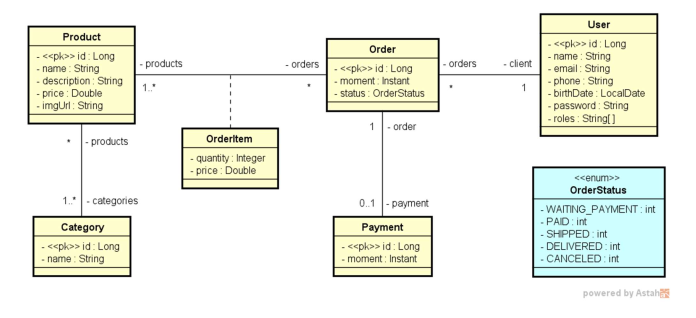

# DSCommerce

Project developed through the **Spring Professional** course of a store's Rest API.


## Reference

 - <a href="#-uml-diagram">UML Diagram</a>
 - <a href="#%EF%B8%8F-functionalities">Functionalities</a>
 - <a href="#%EF%B8%8F-stacks">Stacks</a>
 - <a href="#%EF%B8%8F-install">Install</a>
 - <a href="#-author">Author</a>
 - <a href="#-next-steps">Next Steps</a>


## 📗 UML Diagram




## 🕹️ Functionalities

- [x]  Login and password system
- [x]  Authentication by roles 
- [x]  Order management (CRUD)
- [x]  Payment management (CRUD)
- [x]  Payment System


## 🛠️ Stacks

- Java 17
- Spring Boot
- Spring Data JPA
- Spring Validations
- Spring Security
- Docker
- PostgreSQL (Dev profile)
- H2 Database (Test profile)
- OAuth2
- Model Mapper


## 🖱️ Install

**1. Download repository**

```bash
  # Clone the repository
  $ git clone git@github.com:alexsanjr/dscommerce.git

  # Go to the folder of project
  $ cd dscommerce
```
**2. Open in your favorite repository**


**3. Import configurations of Postman**
```bash
  # Go to your postmann
  # File > Import (or Ctrl + O)
  # Localize assets folder in the project
  # Drop the arquives.json in the Postmann
```
> DSCommerce.postman_collection.**json** and DSCommerce auth.postman_environment.**json** 

    
## 🧭 Author

**Alexsanjr**

Follow me in:
<a href="https://www.linkedin.com/in/alexsanjr/" target="_blank">LinkedIn</a>

## 🔬 Next Steps

- [ ]  Front-End
- [ ]  Email for sign-up confirm
- [ ]  More custom queries
